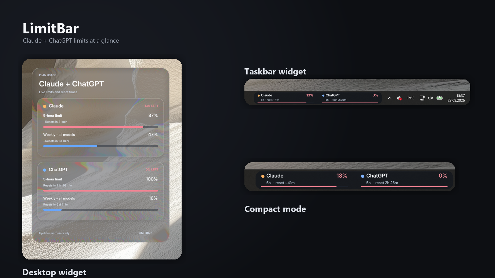

# LimitBar 0.7

Нативный Windows‑индикатор лимитов Claude Code и ChatGPT/Codex: компактный **taskbar island 520×44 px** привязан к правой части панели, а отдельная карточка показывает все доступные окна, проценты остатка и время до reset.




## Что изменилось в 0.5

- Настоящий динамический glass: фон рабочего стола захватывается через DXGI Desktop Duplication и обрабатывается D3D11/HLSL в реальном времени.
- Визуальная модель перенесена из `liquid-glass-ubersicht`: широкое краевое преломление, цветовое расщепление, холодный tint, внутреннее верхнее свечение и тонкая зеркальная кромка.
- Во время перетаскивания используется стабильный полноэкранный кадр, который пересэмплируется по текущей позиции карточки; после отпускания выполняется один свежий захват.
- Подробное окно перекомпоновано в две самостоятельные стеклянные карточки с увеличенной типографикой и гарантированными зонами для процентов и reset time.
- Нет чёрной подложки, периодических скриншотов, накопления старых кадров и нарисованной светлой рамки.
- Островок выше стандартной панели: нижняя часть визуально связана с taskbar, верхние 16 px выступают над ней.
- Две независимые колонки Claude и ChatGPT. Название, процент, подпись окна и progress bar имеют отдельные зоны; длинные названия сокращаются, а не залезают на процент.
- Масштаб 100–200% не умножается дважды: компоновка остаётся внутри фиксированного окна.
- Цвет остатка читается без легенды: зелёный — спокойно, янтарный — пора экономить, красный — почти исчерпано.

## Быстрый старт

1. Авторизуйте нужные локальные клиенты:

   - `claude login`
   - `codex login` с входом через ChatGPT

2. Распакуйте portable‑архив целиком и запустите `LimitBar.exe`. Папка `glass` должна лежать рядом с EXE.

Значок LimitBar появляется в tray. Подробная карточка закреплена на уровне рабочего стола: обычные приложения всегда находятся поверх неё. В tray доступны ручное обновление, включение/выключение островка и автозапуск.

Команда Windows **Win+D** не скрывает desktop-карточку: когда активен рабочий стол, renderer временно поднимает её над обоями; при возврате к обычному окну topmost автоматически снимается, поэтому приложения остаются выше виджета.

В подменю **Notifications** отдельно включаются предупреждения о скором reset с большим остатком, слишком быстром расходе, восстановлении лимита и проблемах обновления. Одинаковое событие показывается один раз; по умолчанию действуют тихие часы 23:00–08:00.

Для снимка экрана включите в tray пункт **Allow screenshots**. LimitBar станет видимым для Snipping Tool, Print Screen и screen sharing без рекурсивного отражения. При переключении или сворачивании окон чистый backdrop обновляется автоматически. После снимка выключите пункт, чтобы вернуть постоянное живое обновление фона и защиту содержимого.

Для демонстрации без аккаунтов:

```powershell
$env:LIMITBAR_DEMO = "1"
.\dist\LimitBar.exe
```

> Надпись ChatGPT означает подписочную квоту Codex/ChatGPT Work, которую отдаёт локальный Codex client. Обычные consumer message caps ChatGPT пока не имеют стабильного публичного API и не извлекаются из cookies браузера.

## Архитектура

```text
Claude Credential Manager / login ──> Claude adapter ─┐
                                                       ├─> snapshots.json ─> DX11 glass UI
Codex app-server (read-only) ───────> Codex adapter ───┘          ↑
                                                    polling + backoff
```

- Python‑контроллер отвечает за провайдеры, polling, backoff, кэш, tray и автозапуск.
- `LimitBar.Glass.exe` — маленький отдельный нативный процесс рендера. Он не внедряет DLL в Explorer и не может уронить taskbar.
- Claude adapter повторно использует вход Claude Code через Windows Credential Manager или стандартный credentials file. OAuth token остаётся в памяти и не записывается LimitBar.
- Codex adapter запускает `codex -s read-only -a never app-server` и вызывает `account/rateLimits/read`; `~/.codex/auth.json` не читается.
- Каждый источник опрашивается независимо раз в 180 секунд. Ошибки включают exponential backoff с jitter до 30 минут; `Retry-After` имеет приоритет.
- На диск попадают только проценты, reset time и timestamp последнего успешного ответа. Логи ротируются, Bearer/API tokens редактируются фильтром.
- Нестабильные provider endpoints изолированы адаптерами. При изменении схемы интерфейс показывает last-good cache или `Connecting…`, а не выдуманные значения.
- Если точный Claude OAuth endpoint недоступен, fallback Claude Desktop берёт проценты из локальной history. Этот файл не содержит reset timestamp, поэтому LimitBar оценивает следующий reset только после реально замеченного обнуления rolling window. Такое время всегда помечается `~`; без достаточной истории интерфейс честно показывает `Reset time unavailable`.

Основные каталоги:

```text
src/limitbar/
  adapters/       Claude и Codex источники
  poller.py       независимый polling/backoff
  cache.py        атомарный secret-free cache
  native_ui.py    tray и запуск нативных окон
  ui.py           резервный интерфейс без GPU
native/LimitBar.DX11/
  src/glass/      DXGI capture + D3D11/HLSL material
  src/main.cpp    taskbar island и desktop card
```

## Почему это не официальный Windows Widget

Публичный Windows Widgets API размещает сторонние виджеты в Widgets Board (`Win+W`), а не разрешает постоянно вставлять произвольную карточку внутрь Explorer taskbar. LimitBar поэтому использует изолированное topmost‑окно, точно привязанное к `Shell_TrayWnd`: визуально это часть панели, но без Explorer injection. Такое решение безопаснее и переживает перезапуск Explorer.

## Исследованные решения

- [liquidDX11](https://github.com/poncippg-spec/liquidDX11) — удачная основа настоящего desktop‑backdrop: DXGI Desktop Duplication, D3D11/HLSL и DirectComposition. MIT‑часть адаптирована с сохранением notice и лицензии в `native/LimitBar.DX11`.
- [liquid-glass-ubersicht](https://github.com/sa1emie/liquid-glass-ubersicht) — визуальная модель текущего материала: 55 px rim, 28 px refraction, chromatic fringe, cool tint, top glow и crisp specular edge. HLSL-порт распространяется с исходным MIT notice.
- [LiquidGlassWinUI](https://github.com/luckyelysia/LiquidGlassWinUI) — качественный compositor shader, но внешний WinUI backdrop не видит пиксели рабочего стола; поэтому для LimitBar он давал чёрный фон и не используется в релизе.
- [Taskbar Media Presence](https://github.com/MrBoxik/Taskbar-Media-Presence) и [Windhawk taskbar performance widget](https://github.com/ramensoftware/windhawk-mods/pull/4299) — ориентиры по компактной информации возле системного tray.
- [Windows 11 Taskbar Styling Guide](https://github.com/ramensoftware/windows-11-taskbar-styling-guide) — учтены реальные зоны и ограничения панели Windows 11.
- [codex-usage-widget](https://github.com/ognjeeen/codex-usage-widget) и [codex-usage](https://github.com/Tooblippe/codex-usage) — безопасный Codex путь через локальный app-server.
- [Tray Usage Monitor](https://github.com/Firnschnee/Tray-Usage-Monitor) и [claude-usage-tray](https://github.com/ksmaster03/claude-usage-tray) — Claude OAuth schema, Credential Manager fallback и консервативный polling.

## Сборка

Нужны Windows 10/11 x64, Python 3.11+ и Visual Studio Build Tools с workload **Desktop development with C++**:

```powershell
.\build.ps1
```

Скрипт запускает тесты, собирает native renderer и создаёт:

```text
dist/LimitBar.exe
dist/glass/LimitBar.Glass.exe
dist/glass/THIRD-PARTY-*.md|txt
```

Запуск из исходников:

```powershell
python -m pip install -e .
.\run.ps1
```

Резервный интерфейс: `$env:LIMITBAR_LEGACY_UI = "1"`.

## Приватность и ограничения

- Нет telemetry, удалённого backend и browser scraping.
- Настройки, кэш и лог находятся в `%LOCALAPPDATA%\LimitBar`.
- Usage endpoints Claude и Codex — implementation details поставщиков и могут измениться; адаптеры дают graceful fallback.
- По умолчанию glass‑окна защищены `WDA_EXCLUDEFROMCAPTURE`, поэтому они отсутствуют на скриншотах и screen sharing. Защиту можно временно снять пунктом **Allow screenshots** в tray; в этом режиме backdrop фиксируется, чтобы не возникало рекурсивного захвата.
- Multi-monitor taskbar пока привязывается к основной панели.

## Лицензия

LimitBar — MIT. Сторонние notice находятся рядом с соответствующим native renderer. Названия Claude, Anthropic, ChatGPT, OpenAI и Codex принадлежат их владельцам; проект с ними не аффилирован.

